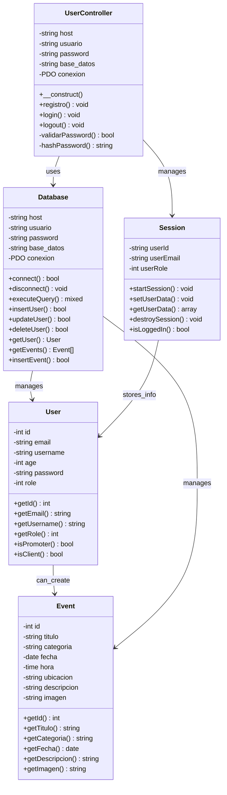
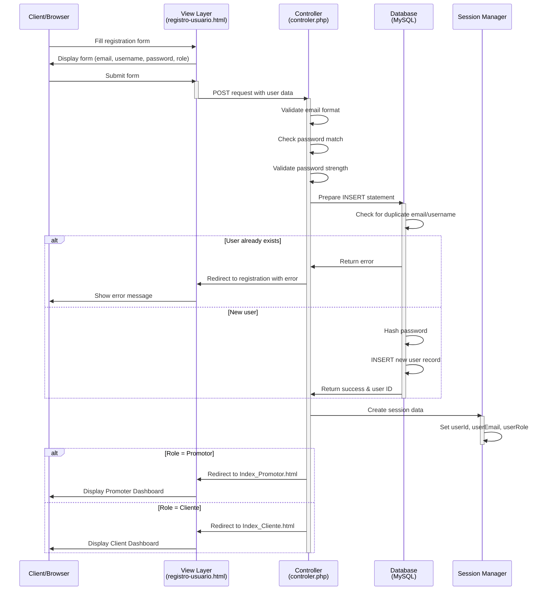
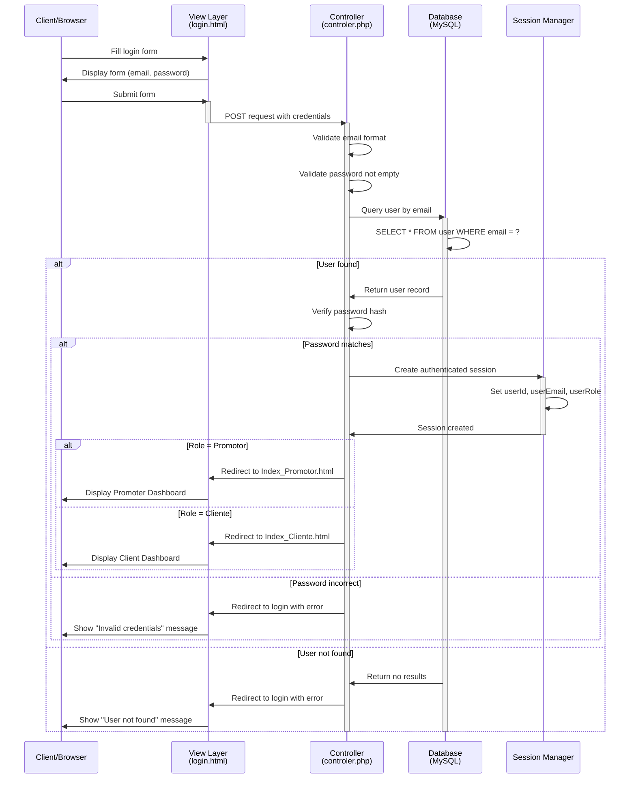
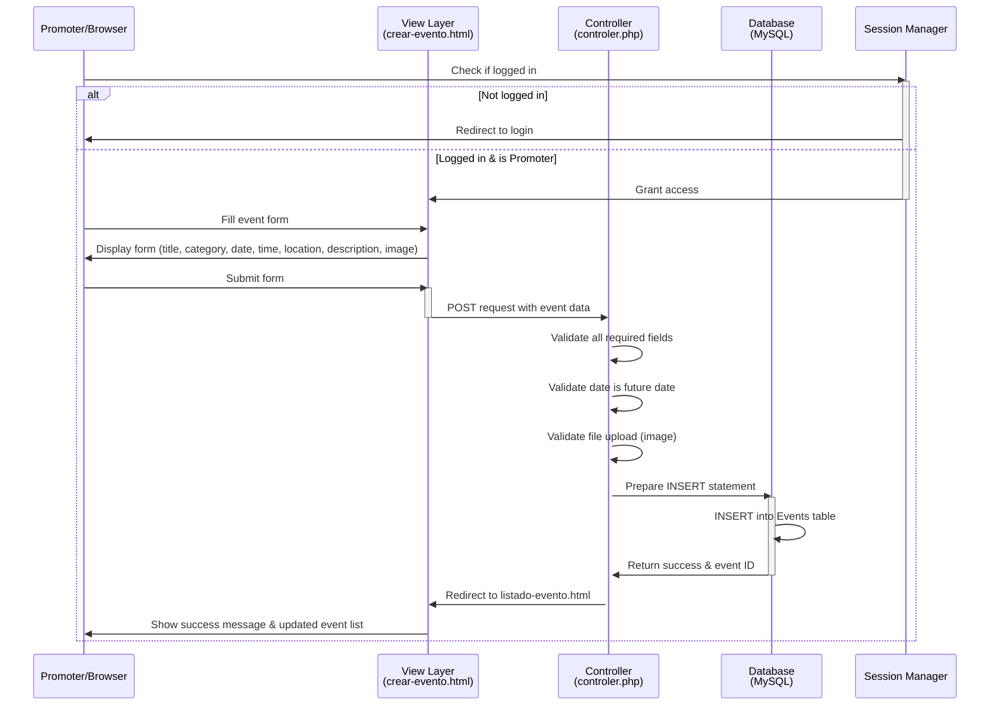
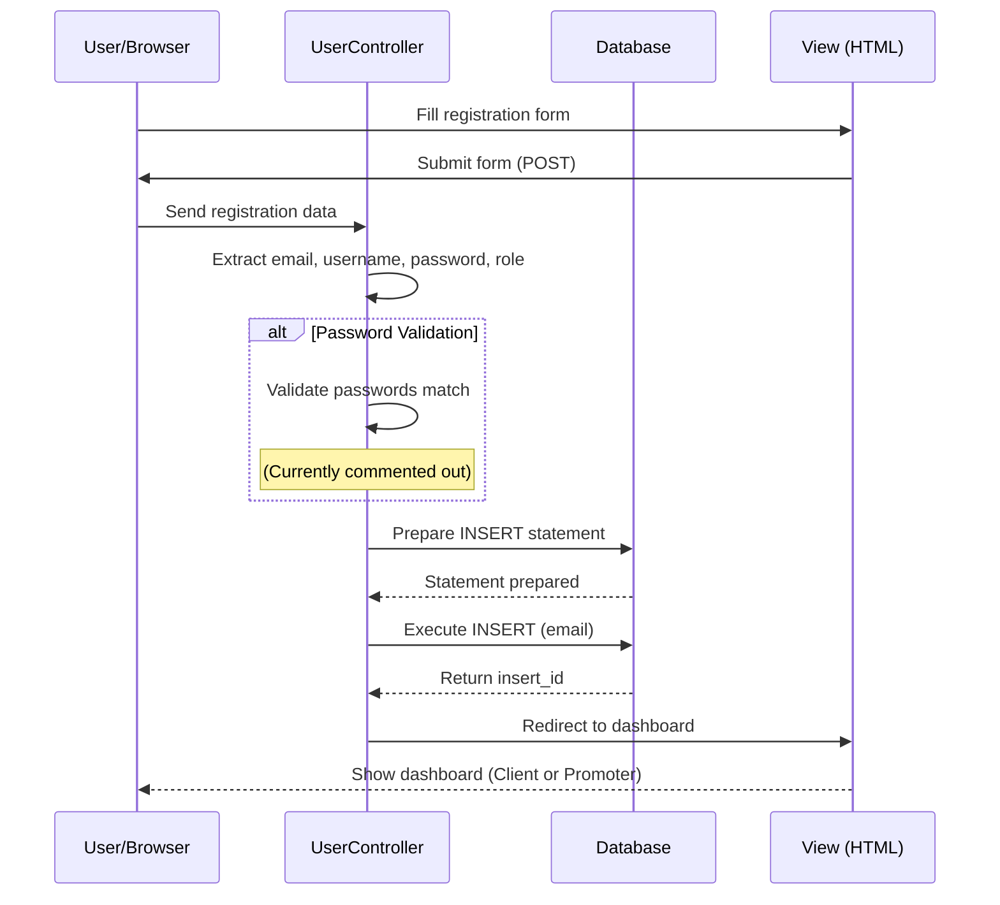
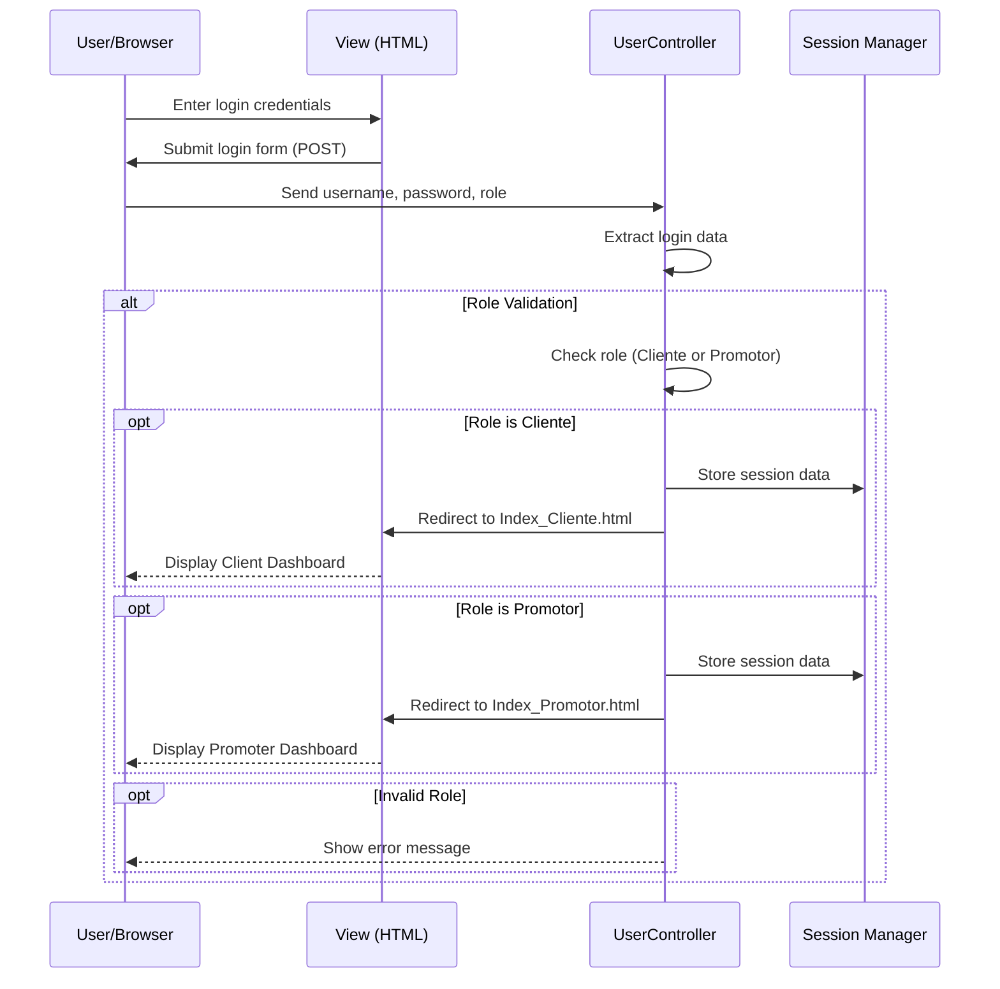

# Zentry - Event Management Platform

Zentry is a web application for managing and discovering gaming events. It provides functionality for both regular users (Clientes) and event promoters (Promotores) to interact with events related to gaming industry conferences and events.

## Overview

Zentry is built using the **MVC (Model-View-Controller)** architecture pattern and uses PHP with MySQL as the backend. It supports two user roles:
- **Clientes**: Regular users who can browse and search for events
- **Promotores**: Event promoters who can create and manage events

## Project Structure

```
Zentry/
├── Model/
│   ├── Zentry.sql           # Database schema and user setup
├── Controler/
│   └── controler.php        # User authentication controller
└── View/
    ├── index.html           # Home page
    ├── login.html           # Login page
    ├── registro-usuario.html # User registration
    ├── registro-promotor.html# Promoter registration
    ├── Index_Cliente.html    # Client dashboard
    ├── Index_Promotor.html   # Promoter dashboard
    ├── crear-evento.html     # Create event page
    ├── listado-evento.html   # Event listing
    ├── buscar-evento.html    # Event search
    ├── detalle-evento.html   # Event details
    ├── perfil-usuario.html   # User profile
    ├── styles.css            # Styling
    ├── Audios/               # Audio resources
    ├── Imagenes/             # Image resources
    ├── Videos/               # Video resources
    └── JQuery/               # jQuery scripts
        └── JQuery.js         # jQuery utilities
```

---

## Architecture Diagrams

### Class Diagram

The following diagram illustrates the main classes and their relationships:



### Sequence Diagram - User Registration Flow

The following diagram shows the sequence of events during user registration:



### Sequence Diagram - User Login Flow

The following diagram shows the sequence during user login:



### Sequence Diagram - Event Creation Flow

The following diagram shows the sequence when a promoter creates an event:



---

## Database Schema

### User Table
```sql
CREATE TABLE User (
    id INT PRIMARY KEY AUTO_INCREMENT,
    email VARCHAR(200) NOT NULL UNIQUE,
    username VARCHAR(50) NOT NULL UNIQUE,
    age INT NOT NULL,
    password VARCHAR(50) NOT NULL CHECK (CHAR_LENGTH(password) > 8),
    role BOOLEAN NOT NULL (0=Cliente, 1=Promotor)
);
```

### Events Table
```sql
CREATE TABLE Events (
    id INT PRIMARY KEY AUTO_INCREMENT,
    titulo VARCHAR(100) NOT NULL,
    categoria VARCHAR(50) NOT NULL,
    fecha DATE NOT NULL,
    hora TIME NOT NULL,
    ubicacion VARCHAR(200) NOT NULL,
    descripcion TEXT NOT NULL,
    imagen VARCHAR(200) NOT NULL
);
```

---

## Key Features

✅ **User Authentication**: Secure login and registration system with role-based access  
✅ **User Roles**: Two distinct roles - Clients and Promoters  
✅ **Event Management**: Create, view, search, and filter gaming events  
✅ **Event Categories**: Support for multiple gaming event categories  
✅ **User Profiles**: Users can view and manage their profiles  
✅ **Responsive Design**: Mobile-friendly interface using CSS and jQuery  
✅ **Database Security**: PDO prepared statements to prevent SQL injection  

---

## Technologies Used

- **Backend**: PHP with PDO (PHP Data Objects)
- **Database**: MySQL
- **Frontend**: HTML5, CSS3, jQuery
- **Architecture**: MVC (Model-View-Controller)
- **Security**: Password validation, prepared statements, session management

---

## Installation & Setup

1. **Create Database**:
   ```bash
   mysql -u root -p < Model/Zentry.sql
   ```

2. **Configure Database Connection**:
   Update database credentials in `Controler/controler.php`

3. **Deploy Files**:
   Place all files in your web server root directory (e.g., `/htdocs/Zentry`)

4. **Access Application**:
   Navigate to `http://localhost/Zentry/View/index.html` in your browser

---

## File Descriptions

| File | Purpose |
|------|---------|
| `controler.php` | Handles authentication (login, registration, logout) with PDO |
| `Zentry.sql` | Creates database, user account, and table schemas |
| `index.html` | Home page landing |
| `login.html` | User login interface |
| `registro-usuario.html` | Client registration form |
| `registro-promotor.html` | Promoter registration form |
| `Index_Cliente.html` | Client dashboard with event browsing |
| `Index_Promotor.html` | Promoter dashboard for event management |
| `crear-evento.html` | Form to create new events |
| `listado-evento.html` | Display all events |
| `buscar-evento.html` | Event search interface |
| `detalle-evento.html` | Individual event details page |
| `perfil-usuario.html` | User profile management |
| `styles.css` | Global styling for all pages |

---

## Future Enhancements

- Event registration/ticket booking system
- User ratings and reviews for events
- Event notifications and reminders
- Admin dashboard for system management
- Payment integration for paid events
- Social sharing features
- Email verification for new accounts
- Password reset functionality
        -string usuario
        -string password
        -string base_datos
        -mysqli conexion
        
        +conectar() mysqli
        +insertUser() bool
        +updateUser() bool
        +deleteUser() bool
        +getUserById() array
    }
    
    UserController --> DatabaseManager: uses
    
    class User {
        +int id
        +string email
        +string username
        +int age
        +string password
        +string role
    }
    
    DatabaseManager --> User: manages
```

## Sequence Diagram - User Registration Flow

The following diagram shows the sequence of events during user registration:



## Sequence Diagram - User Login Flow

The following diagram shows the sequence of events during user login:



## Database Schema

The application uses a MySQL database with the following main table:

### User Table
| Column   | Type    | Description      |
|----------|---------|------------------|
| id       | INT     | Primary Key      |
| email    | VARCHAR | User email       |
| username | VARCHAR | Username         |
| age      | INT     | User age         |
| password | VARCHAR | Hashed password  |
| role     | VARCHAR | User role (Cliente/Promotor) |

## Features

- **User Authentication**: Login and registration for both clients and promoters
- **Event Management**: Create, search, and view events
- **User Profiles**: Manage user profile information
- **Role-Based Access**: Different dashboards for clients and promoters
- **Event Details**: View detailed information about specific events

## Installation

1. Place the project in your XAMPP htdocs folder: `xampp/htdocs/zentryGames/Zentry/`
2. Create the MySQL database using `baseDatos.sql`
3. Update database credentials in `baseDatos.php` and `controler.php` if needed
4. Access the application through your local server: `http://localhost/zentryGames/Zentry/`

## Technologies Used

- **Backend**: PHP 7.x+
- **Database**: MySQL
- **Frontend**: HTML5, CSS3
- **Server**: Apache (XAMPP)

## Future Improvements

- [ ] Implement password hashing (use `password_hash()` and `password_verify()`)
- [ ] Add input validation and sanitization
- [ ] Implement proper error handling
- [ ] Create a service layer for database operations
- [ ] Add event management functionality
- [ ] Implement user profile management
- [ ] Add search and filter capabilities
