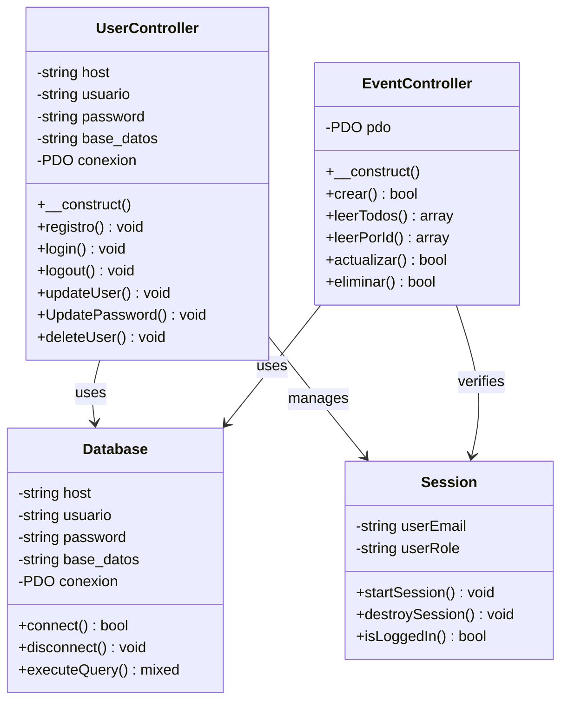
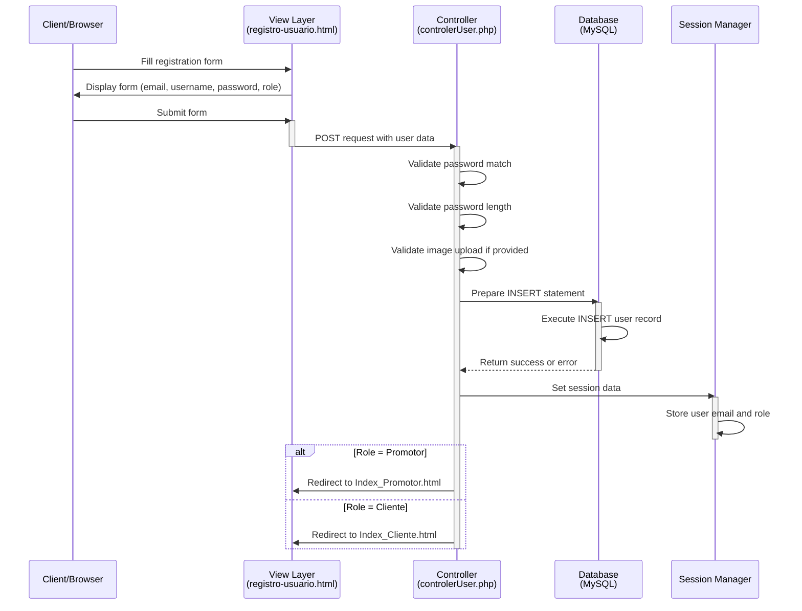
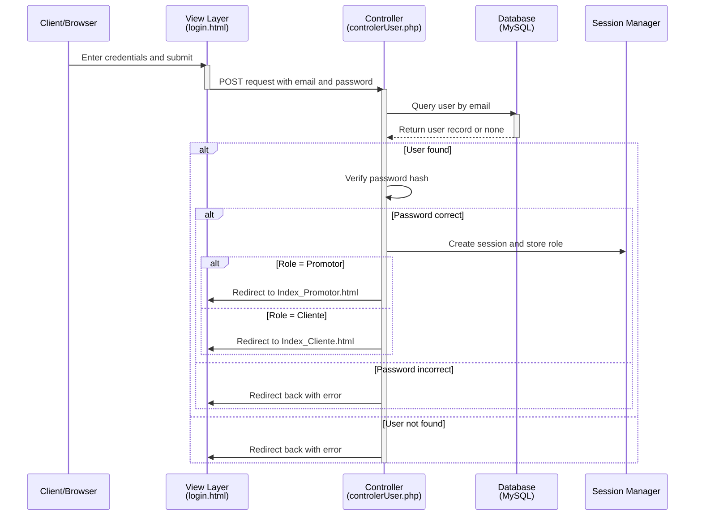
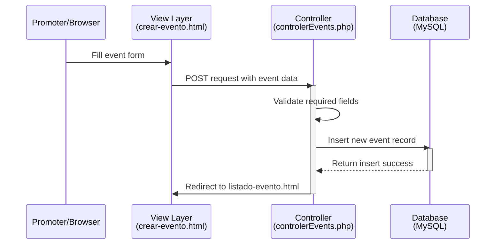

# Zentry - Event Management Platform

Zentry is a web application for managing and discovering gaming events. It provides functionality for both regular users (Clientes) and event promoters (Promotores) to interact with events related to gaming industry conferences and events.

## Overview

Zentry is built using the **MVC (Model-View-Controller)** architecture pattern and uses PHP with MySQL as the backend. It supports two user roles:
- **Clientes**: Regular users who can browse and search for events
- **Promotores**: Event promoters who can create and manage events

## Project Structure

```
Zentry/
├── Controler/
│   ├── controlerUser.php    # User authentication, registration, profile, and account control
│   └── controlerEvents.php  # Event creation and management controller
├── Model/
│   └── Zentry.sql           # SQL script for database and tables
├── View/
│   ├── index.html           # Home page / landing page
│   ├── login.html           # Login page
│   ├── registro-usuario.html # Client registration page
│   ├── registro-promotor.html # Promoter registration page
│   ├── Index_Cliente.html   # Client dashboard
│   ├── Index_Promotor.html  # Promoter dashboard
│   ├── crear-evento.html    # Create event page
│   ├── listado-evento.html  # Event listing page
│   ├── buscar-evento.html   # Event search page
│   ├── detalle_GameAward.html
│   ├── detalle_GamesCom.html
│   ├── detalle_NintendoDirect.html
│   ├── detalle_PlayStation.html
│   ├── detalle_TokyoGameShow.html
│   ├── detalle_Xbox.html
│   ├── perfil-usuario.html  # User profile page
│   ├── styles.css           # Global styles
│   ├── Audios/              # Audio resources
│   ├── Imagenes/            # Image resources
│   ├── Videos/              # Video resources
│   └── JQuery/
│       └── JQuery.js        # jQuery utilities
└── README.md                # Project documentation
```

---

## Architecture Diagrams

### Class Diagram

The following diagram illustrates the main classes and their relationships:



### Sequence Diagram - User Registration Flow



### Sequence Diagram - User Login Flow



### Sequence Diagram - Event Creation Flow



---

## Database

The `Model/Zentry.sql` script creates the database and required tables.

- Database: `Zentry`
- Table `user` with fields: `id`, `username`, `email`, `password`, `role`
- Table `eventos` with fields: `id`, `titulo`, `descripcion`, `fecha`, `ubicacion`

It also creates a MySQL user with these credentials:

- Username: `Zentry_team`@`localhost`
- Password: `Zentry687`

### Database Notes

- `controlerUser.php` connects using `Zentry_team`.
- `controlerEvents.php` connects using `root` with no password.
- Align credentials in both files to avoid connection issues.

---

## Installation & Setup

1. Copy the `Zentry` folder into your XAMPP web root, for example:
   `C:\xampp\htdocs\Zentry`
2. Import `Model/Zentry.sql` into MySQL using phpMyAdmin or the MySQL command line.
3. Start Apache and MySQL from the XAMPP control panel.
4. Create an `uploads/` folder in the project root if it does not exist.
5. Give the `uploads/` folder write permissions.
6. Open the application in your browser at:
   `http://localhost/Zentry/View/index.html`

---

## Usage

- Register as a **Cliente** or **Promotor**.
- Log in with the registered email and password.
- Promoters can create events using `crear-evento.html`.
- Users can browse events in `listado-evento.html` and search events in `buscar-evento.html`.
- Clients access the client dashboard at `Index_Cliente.html`.
- Promoters access the promoter dashboard at `Index_Promotor.html`.
- Users can update their profile and password from `perfil-usuario.html` if that page supports it.

---

## Important Notes

- Passwords must be at least 8 characters long.
- Passwords are hashed using `password_hash` before storing.
- Sessions are managed with `session_start()`.
- Some redirects in `Controler/controlerUser.php` point to `../View/index.php`, while the project currently uses `index.html` in `View/`.
- If `index.php` does not exist, update the redirect paths to `../View/index.html`.
- The image upload feature stores profile images in `uploads/` if a file is provided.

---

## Features

- User authentication (registration, login, logout)
- Role-based access for clients and promoters
- Event creation and management for promoters
- Event listing and event search functionality
- Basic user profile handling

---

## Technologies

- PHP
- MySQL
- HTML
- CSS
- JavaScript / jQuery

---

## Suggested Improvements

- Centralize database connection configuration into a single file.
- Add client-side and server-side form validation.
- Implement proper role-based page access control.
- Add event editing and deletion features.
- Improve user notifications for success and error states.
- Standardize credentials across controllers.

---

## Author

Zentry is a project for managing gaming events, designed as a web application for both clients and promoters.
